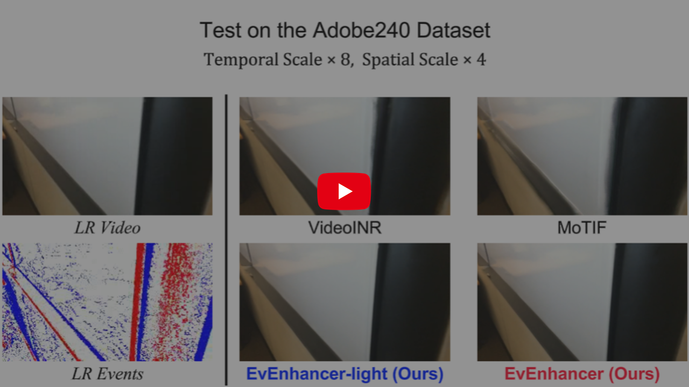

# EvEnhancer: Empowering Effectiveness, Efficiency and Generalizability for Continuous Space-Time Video Super-Resolution with Events (CVPR 2025, Highlight)

**Authors**: [Shuoyan Wei](https://github.com/W-Shuoyan)<sup>1</sup>, [Feng Li](https://lifengcs.github.io/)<sup>2,\*</sup>, [Shengeng Tang](https://tangshengeng.github.io/)<sup>2</sup>, [Yao Zhao](https://scholar.google.com/citations?user=474TbQYAAAAJ&hl=en&oi=ao)<sup>1</sup>,[Huihui Bai](https://scholar.google.com/citations?user=iXuCUcQAAAAJ&hl=en&oi=ao)<sup>1,\*</sup>

<sup>1</sup>*Beijing Jiaotong University*， <sup>2</sup>*Hefei University of Technology*

<small><sup>\*</sup>Corresponding Authors</small>

[](https://w-shuoyan.github.io/EvEnhancer.gitub.io/)
[](https://arxiv.org/abs/2505.04657)
[](https://github.com/W-Shuoyan/EvEnhancer)
[](https://youtu.be/GenHXBxqXsc)

This repository contains the reference code for the paper "[**EvEnhancer: Empowering Effectiveness, Efficiency and Generalizability for Continuous Space-Time Video Super-Resolution with Events**](https://arxiv.org/pdf/2505.04657)" accepted to [**CVPR 2025 (Highlight)**](https://cvpr.thecvf.com/virtual/2025/poster/32886).

---

<p align="center">
  <a href="https://youtu.be/GenHXBxqXsc">
    
  </a>
</p>


**In this paper, we introduce EvEnhancer, a novel approach that amalgamates the unique advantages of event streams to enhance the effectiveness, efficiency, and generalizability of Continuous Space-Time Video Super-Resolution.** Our EvEnhancer is underpinned by two critical components: 1) the event-adapted synthesis module (EASM) capitalizes on the spatiotemporal correlations between frames and events to discern and learn long-term motion trajectories, facilitating the adaptive interpolation and fusion of informative spatiotemporal features; and 2) the local implicit video transformer (LIVT), which integrates a local implicit video neural function with cross-scale spatiotemporal attention to learn continuous video representations, enabling the generation of plausible videos at arbitrary resolutions and frame rates.

## 🔈News

- ✅ **[May 2025]** The source code is now available 👉 [](https://github.com/W-Shuoyan/EvEnhancer)
- ✅ **[May 2025]** The arXiv version of our paper has been released 👉 [](https://arxiv.org/abs/2505.04657)
- ✅ **[Apr 2025]** 🎉Our paper is selected to be presented as a **Highlight** in CVPR 2025!
- ✅ **[Mar 2025]** A demo video for our paper has been released 👉 [](https://youtu.be/GenHXBxqXsc)
- ✅ **[Feb 2025]** 🎉Our paper is accepted to **CVPR 2025**!

## 📚 Installation

### Dependencies

- [Python 3.9.21](https://www.python.org/downloads/release/python-3921/)
- [CUDA Toolkit 11.1.1](https://developer.nvidia.com/cuda-11.1.1-download-archive)
- [PyTorch 1.10.1](https://pytorch.org/get-started/previous-versions/#v1101)

```shell
git clone https://github.com/W-Shuoyan/EvEnhancer.git
cd EvEnhancer
conda create -n EvEnhancer python=3.9.21
conda activate EvEnhancer
pip install torch==1.10.1+cu111 torchvision==0.11.2+cu111 torchaudio==0.10.1 -f https://download.pytorch.org/whl/cu111/torch_stable.html
pip install -r requirements.txt
python setup.py develop
cd basicsr/archs/DCNv2 && python setup.py install && cd -
```

## 🚀 Usage

### Data Preparation

| Synthetic Datasets*  | Real-World Datasets |
|:--------------------|:--------------------|
| [Adobe240](https://www.cs.ubc.ca/labs/imager/tr/2017/DeepVideoDeblurring/) (Train & Eval**) | [BS-ERGB](https://github.com/uzh-rpg/timelens-pp/)  （Eval）|
| [GoPro](https://seungjunnah.github.io/Datasets/gopro.html) （Eval）| [ALPIX-VSR](https://github.com/yunfanLu/INR-Event-VSR) （Eval）|

Given a temporal scale `t`, consecutive `(t+1)` frames are selected as a clip.

\* **Event Simulation:** We use [vid2e](https://github.com/uzh-rpg/rpg_vid2e) to simulate Adobe240 and GoPro events in high-resolution. We first use the pre-trained [EMA-VFI](https://github.com/MCG-NJU/EMA-VFI) video frame interpolation model to interpolate the frames in each clip, and then use `esim_torch` in vid2e to simulate the events for each clip, where the parameters are followed as [EvTexture](https://github.com/DachunKai/EvTexture):

```python
import random
import esim_torch

config = {
'refractory_period': 1e-4,
'CT_range': [0.05, 0.5],
'max_CT': 0.5,
'min_CT': 0.02,
'mu': 1,
'sigma': 0.1,
}

Cp = random.uniform(config['CT_range'][0], config['CT_range'][1])
Cn = random.gauss(config['mu'], config['sigma']) * Cp
Cp = min(max(Cp, config['min_CT']), config['max_CT'])
Cn = min(max(Cn, config['min_CT']), config['max_CT'])

esim = esim_torch.ESIM(Cn, Cp, config['refractory_period'])
```

\** The Adobe240 dataset split follows the setting of `Preparing Dataset` in [VideoINR](https://github.com/Picsart-AI-Research/VideoINR-Continuous-Space-Time-Super-Resolution#preparing-dataset).

To accommodate our dataset reading code, it is recommended that all datasets be organized in a similar manner to the [BS-ERGB](https://github.com/uzh-rpg/timelens-pp/) dataset:

```shell
BS-ERGB/ 
├── 1_TEST/   # Test set
│   ├── acquarium_08/    # Video sequence
│   │   ├── events/    # Aligned event data         
│   │   │   ├── 000000.npz
│   │   │   ├── 000001.npz
│   │   │   └── ...
│   │   └── images/  # Video frames         
│   │       ├── 000000.png
│   │       ├── 000001.png
│   │       └── ...
│   └── ...
├── 2_VALIDATION/    # Validation set      
│   └── ...
└── 3_TRAINING/    # Training set   
    └── ...
```

### Training

- **Step1:**

```shell
# EvEnhancer-light
python basicsr/train.py -opt options/train/EvEnhancer_light_step1.yml 
# EvEnhancer
python basicsr/train.py -opt options/train/EvEnhancer_step1.yml
```

- **Step2:**

```shell
# EvEnhancer-light
python basicsr/train.py -opt options/train/EvEnhancer_light_step2.yml 
# EvEnhancer
python basicsr/train.py -opt options/train/EvEnhancer_step2.yml
```

### Evaluation

- **Example 1:** temporal scale `t=4`, spatial scale `s=4`

```shell
# GoPro dataset
# EvEnhancer-light
python basicsr/test.py -opt options/test/EvEnhancer_light_GoPro_T8S4.yml 
# EvEnhancer
python basicsr/test.py -opt options/test/EvEnhancer_GoPro_T8S4.yml
```

- **Example 2:** temporal scale `t=6`, spatial scale `s=4`

```shell
# BS-EGRB dataset
# EvEnhancer-light
python basicsr/test.py -opt options/test/EvEnhancer_light_BS-ERGB_T6S4.yml
# EvEnhancer
python basicsr/test.py -opt options/test/EvEnhancer_BS-ERGB_T6S4.yml
```

### Pretrained Model

- EvEnhancer-light: [**Download🔗**](https://drive.google.com/drive/folders/1SRB3oyDldqEPGlsU3GxB983fsAG_rIzN?usp=sharing)

- EvEnhancer: [**Download🔗**](https://drive.google.com/drive/folders/1n_Wm2xpsPBkYVnUKAW5v_XxPD5H8S0eT?usp=sharing)

## 💡 Cite

If you find this work useful for your research, please consider citing our paper~ 😎

```shell
@article{wei2025evenhancer,
  title={EvEnhancer: Empowering Effectiveness, Efficiency and Generalizability for Continuous Space-Time Video Super-Resolution with Events},
  author={Wei, Shuoyan and Li, Feng and Tang, Shengeng and Zhao, Yao and Bai, Huihui},
  journal={arXiv preprint arXiv:2505.04657},
  year={2025}
}
```

## 📕 Acknowledgement

Our code is built upon [BasicSR](https://github.com/XPixelGroup/BasicSR), which is an open-source image and video restoration toolbox based on [PyTorch](https://pytorch.org/). Thanks to the code reference from:

- [CLIT](https://github.com/jaroslaw1007/CLIT)
- [DCNv2](https://github.com/lbin/DCNv2)
- [EvTexture](https://github.com/DachunKai/EvTexture)
- [REFID](https://github.com/AHupuJR/REFID)
- [TMNet](https://github.com/CS-GangXu/TMNet)
